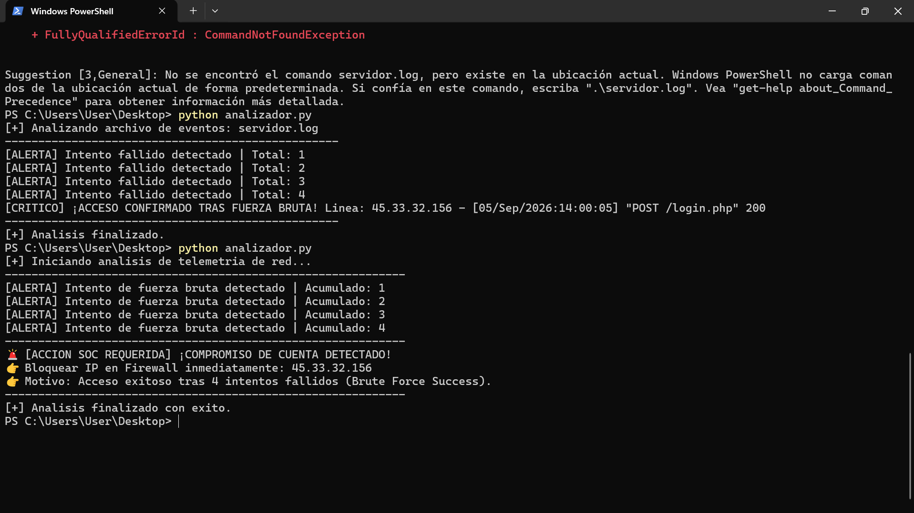

# 🛡️ SOC Log Analyzer - Python & Regex Detection

## 📝 Resumen del Proyecto
Script analítico desarrollado en Python para la automatización de procesamiento de registros en servidores web. El programa analiza telemetría HTTP para identificar patrones de ataques de fuerza bruta (secuencias de respuestas `401 Unauthorized` seguidas de un `200 OK`) y aísla automáticamente la dirección IP del atacante (Indicador de Compromiso - IoC) para su contención inmediata en el Firewall perimetral.

---

## 🛠️ Tecnologías y Entorno
* **Lenguaje:** Python 3.14 (Módulo `re` para Expresiones Regulares)
* **Entorno de Ejecución:** Windows PowerShell / Linux WSL
* **Fundamentos Blue Team:** Análisis de logs HTTP, detección de fuerza bruta, aislamiento de IoCs y respuesta a incidentes.

---

## 🔍 Metodología y Troubleshooting (Bitácora de Terreno)

Durante la implementación del laboratorio se resolvieron los siguientes retos técnicos:
1. **Gestión de Directorios y Rutas:** Diagnóstico y corrección de ejecución en rutas protegidas (`C:\Windows\System32`), moviendo la sesión de PowerShell al espacio de trabajo del usuario (`$HOME\Desktop`).
2. **Normalización de Archivos:** Ajuste en la extensión de lectura del archivo de logs para evitar bloqueos por extensiones ocultas (`.txt` vs `.log`).
3. **Optimización con Regex:** Implementación de patrones de búsqueda (`re.search`) para extraer únicamente la dirección IP sin ruido de texto adicional, acelerando el triaje analítico del operador del SOC.

---

## 📸 Evidencia de Ejecución en Consola



---

## 🚨 Ejemplo de Salida en Consola

```text
[+] Iniciando analisis de telemetria de red...
------------------------------------------------------------
[ALERTA] Intento de fuerza bruta detectado | Acumulado: 1
[ALERTA] Intento de fuerza bruta detectado | Acumulado: 2
[ALERTA] Intento de fuerza bruta detectado | Acumulado: 3
[ALERTA] Intento de fuerza bruta detectado | Acumulado: 4
------------------------------------------------------------
🚨 [ACCION SOC REQUERIDA] ¡COMPROMISO DE CUENTA DETECTADO!
👉 Bloquear IP en Firewall inmediatamente: 45.33.32.156
👉 Motivo: Acceso exitoso tras 4 intentos fallidos (Brute Force Success).
------------------------------------------------------------
[+] Analisis finalizado con exito.
